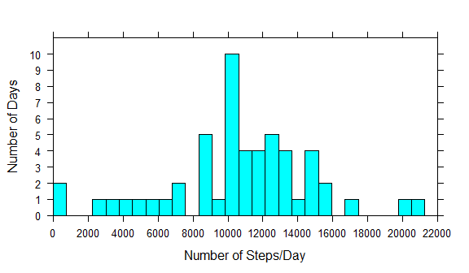
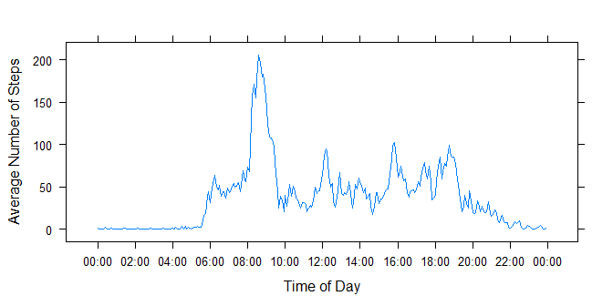
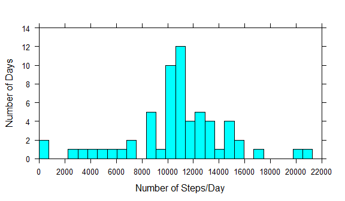
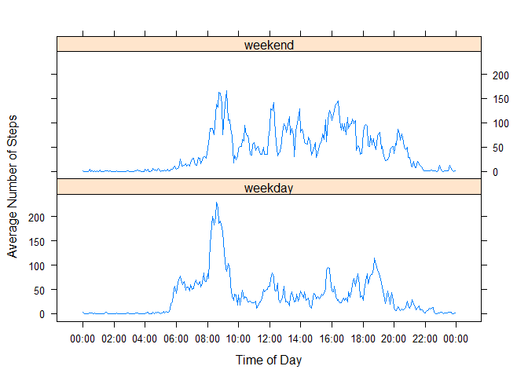
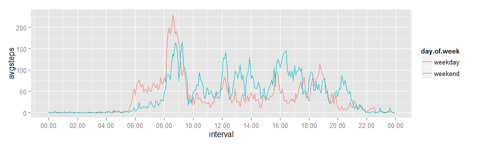

# Reproducible Research: Peer Assessment 1


## Loading and preprocessing the data

To load the data, we need to set the working directory and then load it into a data frame:

```r
setwd("C:/Users/David/Documents/GitHub/RepData_PeerAssessment1")
activity.orig <- read.csv("activity.csv")
```
    
The data includes dates and intervals (aka times); however, these intervals should be preprocessed as a vector of *POSIXct* variables and coerced into the format **HH:MM** (with a dummy date of `1970-01-01` to simplify plotting the mean number of steps at each 5 minute interval). This is accomplished using  the following steps:  
   
    - Extract the interval vector  
    - Transform the vector elements into the form "HHMM" (so "0" reads as "0000", "5 becomes "0005", and so on)  
    - Add the dummy date "19700101"" to each element  
    - Transform the character vector to POSIXct

```r
intervals <- as.numeric(activity.orig$interval)
hoursandmin <- gsub(" ", "0",encodeString(intervals,width=4,justify="r"))
hoursandmin <- paste(rep("19700101",length(hoursandmin)),hoursandmin)
hoursandmin <- as.POSIXct(strptime(hoursandmin,format="%Y%m%d %H%M"))
activity.post <- cbind(activity.orig, hoursandmin)
```

## What is mean total number of steps taken per day?

To make a histogram of the total number of steps taken each day, a vector is created that sums all the steps taken in the 5 minute interval of each day (with the days as row names):

```r
activity.byday <- tapply(activity.post$steps, activity.post$date, sum)
library("lattice", lib.loc="C:/Program Files/R/R-3.1.2/library")
histogram(activity.byday, nint=30, type="count",
          xlab = "Number of Steps/Day",
          ylab = "Number of Days",
          xlim = c(0, 22000),
          ylim = c(0, 11),
          scales = list(
              x = list(at=seq(0, 22000, 2000)),
              y = list(at=seq(0, 10, 1))))
```

 
       
The `na.rm=TRUE` option is used to calculate the mean and median total number of steps:

```r
mean(activity.byday, na.rm=TRUE)
```

```
## [1] 10766.19
```

```r
median(activity.byday, na.rm=TRUE)
```

```
## [1] 10765
```
The mean number of total steps per day is **10,766.19** and the median is **10,765**.

## What is the average daily activity pattern?

To make the time series plot of the average number of steps (averaged across all days) taken at each 5 minute interval, the data frame `activity.post` is used with the new `hoursandmin` column to calculate the mean number of steps:

```r
activity.avginter <- 
    tapply(activity.post$steps, activity.post$hoursandmin, mean, na.rm=TRUE)

interval.plotopt <- as.POSIXct(row.names(activity.avginter))

x.labels <- seq(
    interval.plotopt[1],interval.plotopt[length(interval.plotopt)]+600,7200)

library("lattice", lib.loc="C:/Program Files/R/R-3.1.2/library")
xyplot(activity.avginter ~ interval.plotopt, type="l",
       xlab = "Time of Day",
       ylab = "Average Number of Steps",
       scales = list(
           x = list(at=x.labels, labels=format(x.labels, "%H:%M"))))
```

 
  
  
To find the interval with the maximum number of steps on average, the `which.max` function is used to locate the row in `activity.avginter` with that maximum value which, in turn, is referenced to find the associated interval:

```r
activity.avginter[(which.max(activity.avginter))]
```

```
## 1970-01-01 08:35:00 
##            206.1698
```
The 5 minute interval that, on average, has the greatest number of steps is the interval, **08:35-08:40**, containing **206.17 steps**.

## Imputing missing values
To find the number of missing values, the `length` of the vector resulting from finding the row numbers (using `which`) containing `NA`s:

```r
length(which(is.na(activity.orig$steps)))
```

```
## [1] 2304
```
The total number of missing values is **2,304**.  
  
To fill in the missing values, these were the steps that were followed:  

- A vector of row numbers containing missing values was initialized.  
- Another vector of all the time intervals (in POSIXct format) was formed.  
- A function was written that, using a for-loop, filled in the missing values.    


The function performed the following operations using the data frame containing intervals in POSIXct format:  

- Cycling through each row number containing missing values, the associated time interval was obtained.  
- Then using a `which` function, the average number of steps for that interval replaced the missing value in the data frame.    
  
The resulting data frame would then only contain complete cases.  

```r
activity.na <- which(is.na(activity.orig$steps))
interval.conv <- row.names(activity.avginter)

activity.rep <- function(orig, narow, interdata, internames) {
    new.activity <- orig
    for(i in 1:length(narow)) {
        test.interval <- new.activity$hoursandmin[narow[i]]
        new.activity$steps[narow[i]] <- interdata[which(internames == test.interval)]
    }
    return(new.activity)
}

activity.imputed <- activity.rep(activity.post, activity.na, activity.avginter, interval.conv) 
```
  
Plotting the histogram of the new dataset:

```r
activity.imp.byday <- tapply(activity.imputed$steps, activity.imputed$date, sum)
library("lattice", lib.loc="C:/Program Files/R/R-3.1.2/library")
histogram(activity.imp.byday, nint=30, type="count",
          xlab = "Number of Steps/Day",
          ylab = "Number of Days",
          xlim = c(0, 22000),
          ylim = c(0, 14),
          scales = list(
              x = list(at=seq(0, 22000, 2000)),
              y = list(at=seq(0, 14, 2))))
```

 

Calculating the mean and median total number of steps, this time without the `na.rm` option:

```r
mean(activity.imp.byday)
```

```
## [1] 10766.19
```

```r
median(activity.imp.byday)
```

```
## [1] 10766.19
```
  
The mean total number of steps taken per day did not change, but the median did. In fact, the median number of steps per day is now equal to the mean, **10,766.19 steps**.  

## Are there differences in activity patterns between weekdays and weekends?

To figure this out, the days of the week are extracted from the imputed dataset and a function written and executed to substitute those entries with the factors, `weekday` and `weekend`.   

```r
activity.week <- weekdays(as.Date(activity.imputed$date))

replwk <- function(weekact) {
    newweek <- weekact
    
    for (i in 1:length(weekact)) {
        
        if (weekact[i] == "Saturday") {
            newweek[i] <- "weekend"
        }
        else if (weekact[i] == "Sunday") {
            newweek[i] <- "weekend"
        }
        else {
            newweek[i] <- "weekday"
        }    
    }
    return(newweek)
}

day.of.week <- replwk(activity.week)
```
  
  
Then, the new factor vector is added to the data frame and the average number of steps for each 5 minute interval across weekday/weekend days is computed. 

```r
activity.imp.wkdy <- data.frame(activity.imputed, day.of.week)
activity.inter.wkdy <- tapply(activity.imp.wkdy$steps, 
        list(activity.imp.wkdy$hoursandmin, activity.imp.wkdy$day.of.week),
        mean)
```
  
  
A new data frame is created to facilitate plotting, and the panel plots are generated.

```r
interval <- rep(as.POSIXct(row.names(activity.inter.wkdy)), 2)
day.of.week <- c(rep("weekday",length(interval.conv)),
                 rep("weekend",length(interval.conv)))
avgsteps <- c(activity.inter.wkdy[,1], activity.inter.wkdy[,2])
activity.interpl <- data.frame(interval, day.of.week, avgsteps)

library("lattice", lib.loc="C:/Program Files/R/R-3.1.2/library")
xyplot(activity.interpl$avgsteps ~ activity.interpl$interval 
       | activity.interpl$day.of.week, type="l", 
       layout = c(1, 2), 
       auto.key = TRUE,
       xlab = "Time of Day",
       ylab = "Average Number of Steps",
       scales = list(
           x = list(at=x.labels, labels=format(x.labels, "%H:%M"))))
```

 
   
**BONUS!** I actually prefer `ggplot` to put both plots on one chart, so that a true comparison can be performed.

```r
library("scales", lib.loc="~/R/win-library/3.1")
library("scales", lib.loc="~/R/win-library/3.1")

plot.bonus <- ggplot(activity.interpl, aes(interval, avgsteps, color = day.of.week))
plot.bonus <- plot.bonus + scale_x_datetime(
    labels = date_format("%H:%M"), breaks = "2 hour")
plot.bonus + layer(geom="line")
```

 
   
From this plot, it can be determined that the average number of steps in the morning (6AM to 10AM) for weekdays is greater than weekends, but starting around 10AM and continuing through the afternoon and evening, the average number steps is greater on weekends than on weekday. Certain activities could probably be deduced from this chart (like exercising, eating, going to and leaving work, etc.) but that is beyond the scope of this analysis. :)
